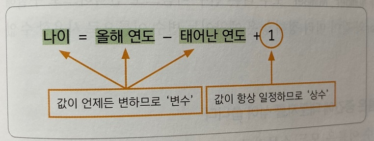
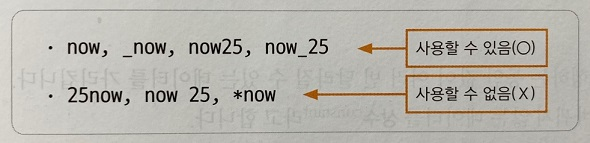
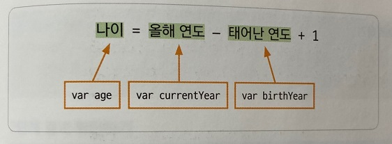

## 변수 알아보기

 

데이터를 다루려면 가장 먼저 '변수' 개념을 알아야 한다.

***
### 변수란?

 

변수(variable)란 프로그램을 실행하는 동안 값이 여러 번 달라질 수 있는 데이터를 가리킨다.

반면에 값을 한번 지정하면 바뀌지 않는 데이터를 상수(constant)라고 한다.

예를 들어 나이를 계산하는 프로그램을 만든다고 가정해 보자.

나이를 계산할 때는 다음과 같은 식을 사용한다.

나이를 계산하는 식에서 맨 끝의 '1'은 값이 변하지 않는 '상수'이다.

하지만 올해 연도와 태어난 연도는 입력하는 사람마다 다르니 '변수'가 된다.

***
### 변수 선언의 규칙

 

변수를 사용하려면 변수를 구별할 수 있도록 이름을 붙여 주어야 하는데, 이것을 변수 선언이라고 한다.

변수 선언은 값을 저장할 컴퓨터 메모리 공간에 문패를 붙이는 것과 같다.

우리는 프로그램 안에서 사용할 값이 메모리의 어느 위치에 저장되는지 신경 쓰지 않아도 된다.

변수 이름만 기억해 놓으면 값을 쉽게 가져와서 사용할 수 있기 때문이다.

또한 바뀐 값을 다시 같은 변수에 저장할 수도 있다.

따라서 프로그램에서 사용할 변수 이름은 서로 다르게 만들어야 한다.

자바스크립트에서 변수를 선언할 때는 지켜야 할 규칙이 몇 가지 있다.

예를 들어 영어 대소 문자를 구별해야하 하고 자바스크립트의 예약어는 사용할 수 없다.

변수 선언의 규칙을 살펴보자

 

1) 변수 이름은 영어 문자와 언더스코어( _ ), 숫자를 사용한다.

    변수 이름의 첫 글자는 영어 대소 문자나 언더스코어( _ )만 쓸 수 있으며 숫자나 기호, 띄어쓰기는 허용하지 않는다.

    예를 살펴보자

 

2) 자바스크립트는 영어 대소 문자를 구별하며 예약어는 변수 이름으로 쓸 수 없다.

    자바스크립트에서는 number와 Number, NumBer 모두 다른 변수 이름으로 인식하므로 구별해서 사용해야 한다.

    그리고 var와 같이 미리 정해 놓은 예약어는 변수 이름으로 사용할 수 없다.

 

3) 여러 단어를 연결한 변수 이름은 중간에 대문자를 섞어 쓴다.

    주로 한 단어로 이루어진 변수 이름은 모두 소문자로 쓰고, 두 단어 이상인 변수 이름은 totalArea나 TotalArea, 또는 Total_Area처럼 중간에 대문자를 섞어 사용한다. 

    이 규칙을 낙타 표기법(camel case)라고 한다.

    반드시 낙타 표기법을 사용해야 하는 것은 아니지만 많은 개발자들이 이 방법을 사용한다.

 

4) 변수 이름은 의미 있게 작성해야 한다.

    자바스크립트로 프로그래밍할 때는 변수를 수십 개 사용하므로 각 변수의 역할을 일일이 기억하기가 쉽지 않다.

    그래서 변수 이름만 보고도 대충 어떤 값인지 추측할 수 있도록 하는 것이 좋다.

    예를 들어 학생들의 시험 점수 합계라면 total로, 평균 점수라면 average로 변수 이름을 정하면 누구나 알아보기 쉽다.

    또한 나이를 계산하는 식에서 올해 연도를 year라고 할 수도 있지만 currentYear로, 태어난 연도는 year2보다 birthYear라고 변수 이름을 정하면 좋다. 
    
    그리고 계산한 값은 age라는 변수에 저장한다.

***
### 변수 선언하기

 

자바스크립트에서 변수 선언은 다음과 같이 var라는 예약어 뒤에 변수 이름을 적으면 된다.

    - 기본형 
    var 변수명

예를 들면 다음과 같이 변수 선언을 할 수 있다.

    var currentYear;
    var birthYear;
    var age;

또는 변수 3개를 한꺼번에 선언할 수도 있다.

다음과 같이 var를 한 번만 쓰고 여러 변수를 쉼표로 구분하여 같은 줄에 선언한다.

    var currentYear, birthyear, age;

변수를 선언했으면 '='기호를 사용해서 변수에 값을 저장할 수 있다.

이것을 값 할당이라고 한다.

값 할당은 변수를 선언한 후에 따로 할 수도 있고, 변수를 선언하면서 동시에 할 수도 있다.

예를 들어 태어난 해가 1995년이라면 다음과 같이 birthYear 변수에 값을 할당한다.

    변수 선언과 값 할당 따로 하기
    
    var birthYear;
    birthYear = 1995;

또는

    변수 선언과 값 할당 같이 하기

    var currentYear = 2021;

