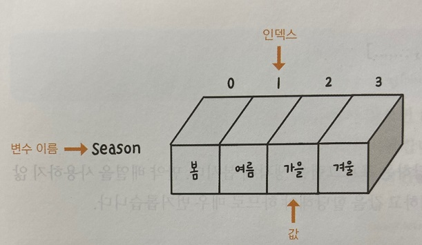

## 자료형 이해하기

***
### 문자열

 

문자열(string)은 작은따옴표('')나 큰따옴표("")로 묶은 데이터를 의미한다.

그래서 숫자도 작은따옴표나 큰따옴표로 묶으면 문자열로 인식한다.

단, 작은따옴표로 시작한 문자열 데이터는 작은따옴표로 끝맺음을 해야 한다. 

큰 따옴표도 마찬가지이다.

만약 큰따옴표로 묶은 문자열 안에 또 다른 문자열을 넣으려면 어떻게 해야 할까?

예를 들어 문자열 안에 span style="color:blue" 처럼 다른 문자열을 넣으려면 어떻게 표현해야할까?

이 경우에는 큰따옴표가 중복되지 않도록 속성값은 작은 따옴표로 묶어서 표현해야 한다.

***
### 논리형

 

논리형은 불린(boolean) 유형이라고도 하며, 참(true)이나 거짓(false)의 값을 표현하는 자료형이다.

어떤 조건을 확인해서 그 조건이 맞으면 true, 맞지 않으면 false의 결괏값을 나타낸다.

주로 프로그램에서 조건을 확인할 때 논리형 데이터를 사용한다.

***
### undefined 유형과 null 유형

 

undefined는 자료형이 정의되지 않았을 때의 데이터 상태를 나타낸다.

자바스크립트에서는 변수를 선언할 때 자료형을 미리 지정하지 않고 값을 할당할 때 결정한다.

그래서 변수 선언만 하고 값이 할당 되지 않은 자료형을 undefined라고 한다.

즉, undefined는 단순히 '변수에 값이 할당되지 않았다'는 의미이다.

반면에 null은 '데이터의 값이 유효하지 않은 상태'를 나타낸다.

undefined와 비슷해 보이지만 구별해야 한다.

정리하자면 undefined는 변수를 선언한 상태에서 값이 할당되지 않은 유형이고, null은 변수에 할당된 값이 유효하지 않다는 의미이다.

***
### 배열

 

지금까지 살펴본 자료형은 변수 하나에 값도 하나만 저장할 수 있지만, 배열(array)은 하나의 변수에 값을 여러 개 저장할 수 있다.

배열은 여러 개의 데이터값을 하나의 배열 이름으로 묶어서 선언한다.

다음과 같이 데이터 값을 쉼표로 구분해서 대괄호([])로 묶으면 배열을 선언할 수 있는데, 대괄호 안에 값을 입력하지 않으면 빈 배열이 만들어진다.

물론 빈 배열도 배열을 선언한 것이 된다.

    - 기본형
    배열명['값1','값2',...] // 값이 있는 배열 선언

    배열명[] // 빈 배열 선언

예를 들어 계절 이름을 변수에 할당하는 프로그램을 생각해 보자.

만약 배열을 사용하지 않으면 다음과 같이 변수를 4개 정의하고 값을 할당해야 하므로 매우 번거롭다.

    var spring - '봄';
    var summer - '여름';
    var fall - '가을';
    var winter - '겨울';

배열을 사용하면 어떻게 될까?

앞에서 4줄로 작성했던 코드를 다음과 같이 간단히 1중짜리 배열로 작성할 수 있다.

    var season = ['봄','여름','가을','겨울']

콘솔 창에서 1줄짜리 코드를 작성하면 season에 저장된 4개의 값이 나타난다.

이때 데이터 옆에는 번호 0~3이 표시되는 이 번호를 인덱스(index)라고 한다.

이처럼 배열은 여러 개의 요소로 구성되고 각 요소는 자신만의 방 번호를 가진다.

이 방 번호가 인덱스이며 0부터 시작한다.

season 배열에서 두 번째 값을 알고 싶다면 

두 번째 요소의 인덱스는 1이므로 콘솔 창에 'season[1]'을 입력하면 '여름' 이라는 데이터를 보여준다.

배열은 for와 같은 반복문을 사용해서 각 요소의 값을 꺼내거나 length 프로퍼티를 사용해서 크기를 확인하는 등 다양하게 활용할 수 있다.

***
### 자바스크립트의 데이터 유형 자동 변환

 

자바스크립트의 편리한 점이면서도 약점이 부분이 데이터 유형이 유연하다는 것이다.

다시 말해 변수의 데이터 유형이 중간에 바뀔 수 있다는 것이다.

앞에서 만든 '나이 계산 프로그램'은 프롬프트 창으로 사용자의 태어난 해를 입력받았다.

이때 프롬프트 창에서 입력받은 값은 문자열이었지만 사칙연산에 사용된 문자열은 자동으로 숫자형으로 변환되어 계산된다.
