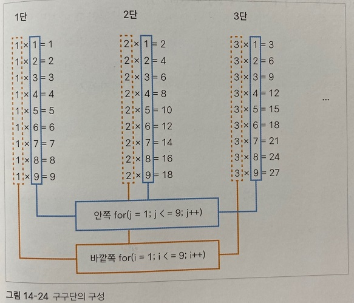

## 반복문 알아보기

***
### 중첩된 for문 사용하기

 

for문 안에 다른 for문을 넣어 사용할 수도 있는데 이것을 중첩된 for문 이라고 한다.

for문은 중첩해서 사용하는 경우가 많다. 

이 경우 안쪽 for 문을 모두 실행한 후 바깥쪽 for문을 실행한다.

구구단을 작성하는 예제로 중첩된 for문을 자세히 알아보자.

 

구구단은 1~9단으로 이루어지고, 각 단은 다시 1~9의 곱으로 구성된다.

1~9단의 카운터 변수는 i로 지정하고, 1~9곱의 카운터 변수를 j로 지정하면 다음과 같이 나타낼 수 있다.

소스 코드를 작성하기 전에 눈으로 먼저 계산해 보면,

i = 1인 상태에서 j가 1~9의 숫자로 바뀌면서 곱셈을 한다.

j가 9보다 크면 1단이 끝난다.

그리고 i값은 1증가시키면 i = 2가 된다.

그리고 2단 계산이 시작된다.

다시 j는 1~9의 숫자로 바뀌면서 계산된다.

 

즉 구구단은 for문 2개를 사용해야 한다.

안쪽 for문을 먼저 실행해서 j값을 바꾸고 바깥쪽 for문의 i값은 나중에 바꾼다.

이렇게 for문을 2개 이상 중첩해서 사용할 때는 먼저 변숫값을 바꾸는 for문을 안쪽에 사용하고 나중에 변숫값이 바뀌는 for문은 바깥쪽에 사용한다.

구구단의 경우 다음과 같이 먼저 바뀌는 카운터 변수 j를 사용하는 for문은 안쪽에, 나중에 바뀌는 카운터 변수 i를 사용하는 for문은 바깥쪽에 배치한다.

여기에서는 몇 단인지 제목을 h3태그로 표시하고 그 아래에 구구단을 표시한다.

각 단마다 한 줄씩 표시되므로 세로로 길게 나타낸다.

[for문 2개로 구구단 만들기](./Doit_JavaScript_day13-1.html)

이 예제는 구구단 전체 내용을 단순히 세로로 길게 표시하므로 한눈에 보기 어렵다.

각 단을 div 태그로 묶고 가로로 나열하여 구구단을 보기 좋게 만들어 보자.

먼저 CSS 파일을 다음과 같이 작성한다.

[구구단 스타일 시트 만들기](./Doit_JavaScript_day13-1.css)

이렇게 스타일 시트를 만들었다면 구구단 소스 앞뒤에 div와 /div태그를 각각 추가하고

head태그에 link rel='stylesheet' href='css 경로' 태그를 추가해 주자