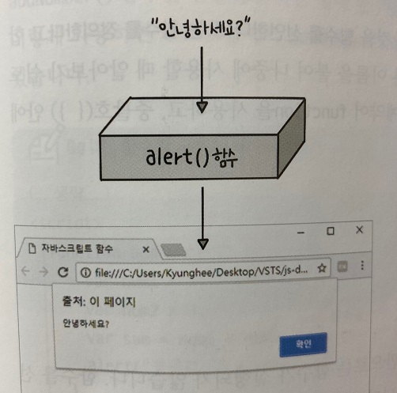

## 함수와 이벤트

 

자바스크립트로 작성한 프로그램은 많은 명령을 순서대로 하나씩 처리한다.

이때 프로그래머는 프로그램의 기능별로 여러 명령을 묶어 놓는데 이것을 '함수'라고 한다.

함수를 사용하면 필요할 때마다 원하는 기능만 실행할 수 있고, 같은 기능이 필요한 다른 곳에서 함수를 재사용할 수도 있다.

여기에서 다룰 함수는 프로그래밍할 때 아주 중요한 개념이니 꼭 이해하고 넘어가야 한다.

함수를 충분히 배운 후 프로그램에서 버튼을 누르거나 이미지 위에 마우스 포인터를 올리는 등의 동작을 뜻하는 이벤트(event)와 연결하는 방법도 살펴보자.

***
## 함수 알아보기

 

함수는 프로그래밍에서 가장 중요한 뼈대를 이룬다.

실제로 웹 브라우저에서는 함수를 사용해서 명령을 내리기 때문이다.

자바스크립트의 함수를 구성하는 여러 명령문은 앞으로 계속 배울 것이므로 함수 개념을 잘 이해하고 넘어가야한다.

***
### 여러 동작을 묶은 덩어리, 함수

 

자바스크립트 프로그램은 단순히 동작 하나만 실행되는게 아니라 여러 가지 동작이 연결된다.

이렇게 동작해야 할 목적대로 묶을 명령을 <b>함수(function)</b>라고 한다.

함수를 사용하면 각 명령의 시작과 끝은 명확하게 구별할 수 있고, 묶은 기능에 이름을 붙여서 어디서든 같은 이름으로 명령을 실행할 수 있다.

자바스크립트에는 여러 함수가 미리 만들어져 있어서 개발자는 가져다 사용하기만 하면 된다.

예를 들어 alert문 같은 것이 자바스크립트에 포함되어 있는 여러 함수 중의 하나이다.

alert 함수의 내부가 어떻게 생겼는지 모르지만 alert 함수가 알림 창을 표시할 때 쓴다는 것을 알고 있다.

그래서 alert 함수의 괄호 안에 내용을 입력하면 웹 브라우저에서 알림 창을 표시할 수 있다.

alert 함수와 같이 자바스크립트에 미리 만들어 놓은 함수를 내장 함수라고 한다.

***
### 함수는 왜 사용할까?

 

개발자는 프로그래밍을 할 때 alert 함수처럼 자바스크립트에 들어 있는 함수를 가져다 사용하거나, 자신이 필요한 명령을 직접 함수로 만들어서 사용한다.

함수를 만드는 방법은 쉽습니다.

예를 들어 다음과 같이 두 수를 더하는 프로그램이 있다면 숫자를 더하는 명령을 묶어 addNumber() 함수로 작성할 수 있다.

이렇게 함수로 만들면 a와 b 자리에 각각 10과 20을 넣거나, 1000과 5000을 넣어 더할 수 있다.

a와 b자리에 숫자 2개를 넣으면 알아서 더해 주는 함수가 만들어진다.

[두 수를 더하는 함수 만들기](./Doit_JavaScript_day15-1.html)

***
## 함수 선언 및 호출

 

함수를 사용하는 가장 기본적인 방법은 함수를 만들 때 이름을 붙이고 필요할 때마다 함수 이름을 사용해 실행하는 것이다.

함수가 어떤 명령을 처리할지 미리 알려 주는 것을 함수를 선언한다 또는 함수를 정의한다고 한다.

함수를 선언할 때는 함수마다 서로 다른 이름을 붙여 나중에 사용할 때 알아보기 쉽도록 한다.

함수를 선언할 때는 다믕과 같이 예약어 function을 사용하고, 중괄호( { } ) 안에 실행할 여러 명령을 넣는다.

    - 기본형
    function 함수명() {
        명령
    }

하지만 프로그램에서는 함수를 선언하는 것만으로는 함수가 실행되지 않는다.

함수를 선언한 후에 따로 실행하는 코드를 작성해야 한다.

함수를 실행하려면 다음과 같이 미리 선언한 함수명을 써서 사용한다.

이렇게 선언한 함수를 사용하는 것을 <b>함수를 호출한다</b> 또는 <b>함수를 실행한다</b>고 한다.

    - 기본형
    함수명() 또는 함수명(변수)

예를 들어 두 수를 더하는 간단한 프로그램을 생각해 보자.

먼저 함수를 사용하지 않고 필요한 명령을 순서대로 나열하면 다음과 같이 작성할 수 있다.

웹 브라우저에서 실행하면 알림 창에서 바로 결괏값을 보여준다.

[함수를 사용하지 않고 두 수 더하기](./Doit_JavaScript_day15-2.html)

이렇게 한 번만 실행하고 끝나는 프로그램도 있지만, 두 수를 더하는 명령을 여러 번 실행해야 한다면 어떻게 할까?

이럴 때 함수가 필요하다.

이번에는 함수를 사용하여 두 수를 더하는 프로그램을 만들어 보자.

다음 소스는 addNumber() 함수를 선언하고 다음 행에 함수를 2번 호출한다.

이렇게 사용하면 프로그램에서 addNumber() 함수가 필요한 곳에 함수를 여러 번 실행할 수 있다.

[함수를 사용해 두 수 더하기](./Doit_JavaScript_day15-3.html)

***
### 함수 선언과 실행 순서

 

웹 브라우저에서 자바스크립트 소스를 해석할 때에는 함수 선언 부분을 가장 먼저 한다.

그래서 개발자가 원하는 어느 곳에 함수를 선언해 놓기만 하면 선언한 위치와 상관없이 함수를 실행할 수 있다.

다음 두 소스 코드를 비교해 보면 함수를 호출, 선언하는 위치가 다르다.

순서는 다르지만 1, 2 둘다 문제 없이 잘 실행되는 소스이다.

    1) 함수 호출을 먼저

    addNumber();

    function addNumber() {
        ...
    }

    2) 함수 선언을 먼저

    function addNumber() {
        ...
    }

    addNumber();

이처럼 함수 선언 위치는 프로그램 흐름에 영향을 주지 않는다.

그래서 보통 한 파일 안에 여러 함수를 선언했을 때 스크립트 소스의 앞부분이나 뒷부분에 함수 선언 부분을 모아 놓고 필요할 때마다 함수를 호출해서 사용한다.