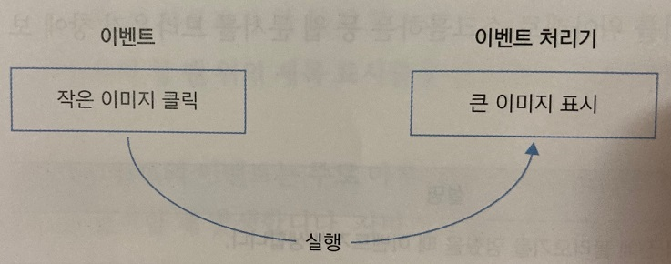

## 이벤트와 이벤트 처리기

***
### 이벤트 처리기 알아보기

 

이벤트에서는 작은 이미지를 클릭하면 큰 이미지를 보여 주거나 폼에서 항목을 선택하면 해당 페이지로 이동하는 등 여러 가지 동작을 실행한다.

위와 같이 웹 문서에서 이벤트가 발생하면 처리하는 함수를 이벤트 처리기 또는 이벤트 핸들러(event handler)라고 한다.

 

이벤트를 처리하는 가장 기본적인 방법은 이벤트가 발생한 HTML 태그에 이벤트 처리기를 직접 연결하는 것이다.

이 방법은 자바스크립트 초기 버전부터 사용했으며 지금도 많이 사용하고 있다.

 

이벤트 처리기의 기본 형식은 다음과 같다.

먼저 HTML 태그 안에서 'on' 다음에 '이벤트명'을 붙여서 속성 이름을 만들고, 그 다음에 실행할 이벤트 처리기의 함수명을 작성하면 된다.

    - 기본형

    <태그 on이벤트명 = '함수명'>

예를 들어 마우스로 클릭했을 때의 이벤트 이름은 click이다.

a 태그 안에 onclick 속성을 만들고 실행할 함수를 연결한다.

다음은 목록에서 각 버튼을 클릭하면 알림 창을 표시하는 예제이다.

[버튼을 클릭하면 알림 창 표시하기](./Doit_JavaScript_day23-1.html)

 

이벤트가 발생한 후에 여러 가지 명령을 실행해야 한다면, 그 명령을 묶어서 하나의 자바스크립트 함수로 만드는 것이 좋다.

그리고 이벤트가 발생할 때 함수 이름과 인수를 지정하여 실행한다.

다음은 웹 요소의 배경색을 바꾸는 changeBg(color) 함수를 미리 만들어서 실행하는 예제이다.

항목을 클릭할 때마다 green이나, orange, purple의 색상값을 인수로 넘겨서 changedBg(color) 함수를 실행한다.

[버튼을 클릭하면 배경색 바꾸기](./Doit_JavaScript_day23-2.html)

