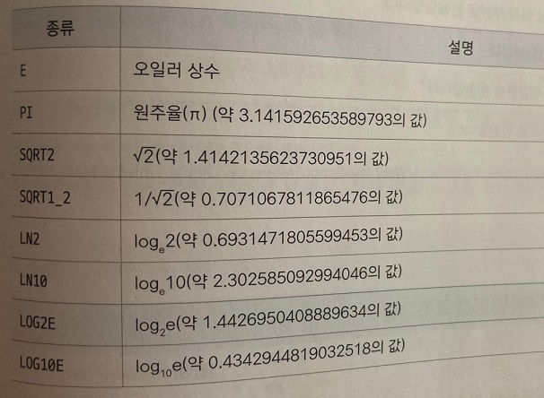

## 자바스크립트의 내장 객체

***
### Math 객체

 

Math 객체에는 수학 계산과 관련된 메서드가 많이 포함되어 있지만 수학식에서만 사용하는 것은 아니다.

무작위 수가 필요하거나 반올림해야 하는 프로그램 등에서도 Math 객체의 메서드를 사용한다.

앞에서 살펴본 Date, Array 객체는 예약어 new로 객체의 인스턴스를 만든 후에 프로그램에서 사용했지만,

Math 객체는 따로 인스턴스를 만들지 않는다.

    - 기본형
    Math.프로퍼티명
    Math.메서드명

이렇게 Math 뒤에 마침표(.)를 찍고 프로퍼티나 메서드 이름을 붙여 사용하면 된다.

지금부터 Math 객체의 프로퍼티와 메서드를 알아보자.

 

### Math 객체의 프로퍼티

Math 객체에서 자주 사용하는 프로퍼티는 다음과 같이 정리할 수 있다.

Math 객체의 프로퍼티는 항상 정해진 값을 가지고 있다.

 

### Math 객체의 메서드

Math 객체의 메서드는 주로 수학과 관련된 함수의 결괏값을 반환한다.

수학 관련 메서드는 어느 정도 수학 지식이 있어야 편리하게 사용할 수 있다.

Math 객체에서 사용하는 메서드는 다음과 같이 정리할 수 있다.

|종류|설명|
|----|----|
|abs()|절댓값을 반환한다.|
|acos()|아크 코사인(arc cosine)값을 반환한다.|
|asin()|아큰 사인(arc sine)값을 반환한다.|
|atan()|아크 탄젠트(arc tangent)값을 반환한다.|
|atan2()|아크 탄젠트(arc tangent)값을 반환한다.|
|ceil()|매개변수의 소수점 이하 부분을 올린다.|
|cos()|코사인(cosine)값을 반환한다.|
|exp()|지수 함수를 반환한다.|
|floor()|매개변수의 소수점 이하 부분을 버린다.|
|log()|매개변수에 대한 로그(log)값을 반환한다.|
|max()|매개변수 중 최댓값을 반환한다.|
|min()|매개변수 중 최솟값을 반환한다.|
|pow()|매개변수의 지숫값을 반환한다.|
|random()|0과 1사이의 무작위 수를 반환한다.|
|round()|매개변수의 소수점 이하 부분을 반올림한다.|
|sin()|사인(sine)값을 반환한다.|
|sqrt()|매개변수에 대한 제곱근을 반환한다.|
|tan()|탄젠트(tangent)값을 반환한다.|

Math 객체의 메서드는 developer.mozilla.org/ko/docs/Web/JavaScript/Reference/Global_Objects/Math

사이트에서 확인할 수 있다.

