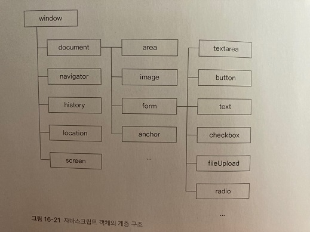

## 브라우저와 관련된 객체

 

자바스크립트를 사용하면 특정한 사이트로 이동하거나 새 탭을 여는 등 웹 브라우저와 관련된 여러 가지 효과를 만들 수 있다.

이런 작업이 가능한 이유는 자바스크립트 내에 웹 브라우저와 관련된 여러 객체가 미리 정의되어 있기 때문이다.

***
### 브라우저와 관련되 객체 알아보기

 

웹 브라우저 창에 문서가 표시되는 순간 사용자는 눈치 채지 못하지만 브라우저는 HTML 소스를 한 줄씩 읽으면서 화면에 내용을 표시하고 관련된 객체를 만들어 낸다.

웹 브라우저가 열리면 가장 먼저 window라는 객체가 만들어지고 밑으로 하위 요소에 해당하는 객체들이 나타난다.

이 하위 객체는 웹 문서와 주소 표시줄 처럼 브라우저 요소에 해당하며 각각 다른 하위 객체를 가진다.

이렇게 만들어진 자바스크립트의 객체는 다음과 같은 계층 구조를 보인다.

예를 들어 window의 하위 객체는 document, history등으로 나위고, 다시 document의 하위 객체는 area, image등으로 구분된다.

 

주로 사용하는 내장 객체는 다음 표와 같이 정리할 수 있다.

|종류|설명|
|----|----|
|window|브라우저 창이 열릴 때마다 하나씩 만들어 진다. 브라우저 창 안의 요소 중에서 최상위에 있다.|
|document|웹 문서마다 하나씩 있으며 body태그를 만나면 만들어진다. HTML 문서의 정보가 담겨 있다.|
|navigator|현재 사용하는 브라우저의 정보가 들어 있다.|
|history|현재 창에서 사용자의 방문 기록을 저장한다.|
|location|현재 페이지의 URL 정보가 담겨 있다.|
|screen|현재 사용하는 화면 정보를 다룬다.|

***
### window 객체의 프로퍼티

 

window 객체는 웹 브라우저의 상태를 제어하며 자바스크립트의 최상위에 있다.

그래서 자바스크립트의 모든 객체는 window 객체 안에 포함된다.

먼저 window 객체의 프로퍼티를 알아보자.

window 객체의 프로퍼티는 주로 웹 브라우저 팡의 정보를 가져오거나 값을 바꿀 때 사용한다.

프로퍼티를 사용하려면 window.fullScreen처럼 프로퍼티 이름 앞에 'window.'을 붙인다.

다음 표는 window 객체의 프로퍼티 중에서 자주 사용하면서도 모든 브라우저에서 호환되는 것을 정리한 것이다.

|종류|설명|
|----|----|
|document|브라우저 창에 표시된 웹 문서에 접근할 수 있다.|
|frameElement|현재 창이 다른 요소 안에 포함되어 있을 경우 그 요소를 반환하고, 반대로 포함되어 있지 않으면 null을 반환한다.|
|innerHeight|내용 영역의 높이를 나타낸다.|
|innerWidth|내용 영역의 너비를 나타낸다.|
|localStorage|웹 브라우저에서 데이터를저장하는 로컬 스토리지를 반환한다.|
|location|window 객체의 위치 또는 현재 URL을 나타낸다.|
|name|브라우저 창의 이름을 가져오거나 수정한다.|
|outerHeight|브라우저 창의 바깥 높이를 나타낸다.|
|outerWidth|브라우저 창의 바깥 너비를 나타낸다.|
|pageXOffset|스크롤했을 때 수평으로 이동하는 픽셀 수로 scrollX와 같다.|
|pageYOffset|스크롤했을 때 수직으로 이동하는 픽셀 수로 scrollY와 같다.|
|parent|현재 창이나 서브 프레임의 부모이다.|
|screenX|브라우저 창의 왼쪽 테두리가 모니터 왼쪽 테두리에서 떨어져 있는 거리를 나타낸다.|
|screenY|브라우저 창의 위쪽 테두리가 모니터 위쪽 테두리에서 떨어져 있는 거리를 나타낸다.|
|scrollX|스크롤헀을때 수평으로 이동하는 픽셀 수를 나타낸다.|
|scrollY|스크롤했을때 수직으로 이동하는 픽셀 수를 나타낸다.|
|sessionStorage|웹 브라우저에서 데이터를 저장하는 세션 스토리지를 반환한다.|

***
### window 객체의 메서드