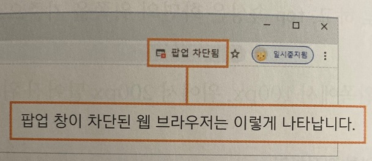

## 브라우저와 관련된 객체

***
### 팝업 차단 고려하기

 

대부분의 팝업 창에서는 사용자에게 광고나 정보를 강제로 전달한다.

따라서 최신 웹 브라우저에서는 창이 열리지 않도록 하는 것을 기본으로 설정하는 경우가 많다.

또한 보안 프로그램이나 관련 유틸리티를 설치하면 웹 브라우저의 팝업이 자동으로 차단되기도 한다.

이런 경우 사용자는 웹 브라우저의 팝업 창이 자동으로 차단된 사길을 모를 수도 있다.

그래서 사이트의 공지와 같은 중요한 내용을 팝업 창으로 보여 주어야 한다면 

팝업 차단된 상태인지 체크하여 사용자에게 알려 주는 것이 좋다.

다음은 팝업 창을 여는 openPop() 함수에서 웹 브라우저의 차단 여부를 확인하는 예제이다.

웹 브라우저에서 팝업을 차단하면 window.open()은 null을 반환한다.

따라서 window.open() 메서드를 실행한 후 반환값을 체크하면 팝업이 차단되었는지 알아낼 수 있다.

[팝업이 차단된 브라우저의 알림 창 표시하기](./Doit_JavaScript_test14.html)

팝업 차단을 해제하려면 주소 표시줄에 있는 팝업 차단 표시 아이콘을 클릭하자.

'팝업 및 리디렉션을 항상 허용'을 선택하고 '완료'를 클릭하면 사용자가 팝업 창을 확인할 수 있다.

 

### 브라우저 창을 닫는 close() 메서드

 

일반적으로 팝업 창 내용을 모두 살펴본 후에 창을 닫을 수 있도록 화면 아래쪽에 '닫기' 버튼이나 링크를 포함하는 경우가 많다.

팝업 창을 여는 메서드가 open()이라면 창을 닫는 메서드는 close()이다.

    - 기본형
    
    window.close()

다음은 간단히 링크나 버튼 태그에 window.close()메서드를 연결한 예제이다.

[버튼을 사용해 팝업 창 닫기](./Doit_JavaScript_test15.html)

 

### 요즘 팝업창은 레이어로 만든다

 

window.close() 메서드를 사용하면 새로운 브라우저 창을 열 수 있고, 창 안에 공지 사항이나 이벤트 내용을 표시할 수 있다.

하지만 이 방법은 웹 브라우저 창의 형태 그대로이므로 트렌트를 반영한 사이트 디자인과 동떨어질 수 있다는 단점이 있다.

그래서 사이트의 디자인과 일관성을 유지하기 위해 최근에는 새로운 방식으로 팝업 창을 표시한다.

이 팝업 창은 div태그를 사용해서 만든다.

레이어 방식을 이용해서 기존 사이트 위에 팝업 창을 겹쳐 놓은 것이다.

자바스크립트의 Document 객체를 사용하여 만들 수 있다.

참고로 팝업 창에서 [오늘 하루 그만 보기]와 같은 옵션은 자바스크립트의 '쿠키'로 제어할 수 있다.

