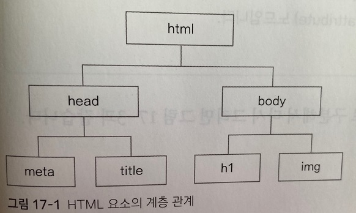
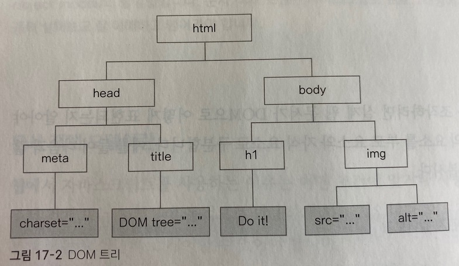
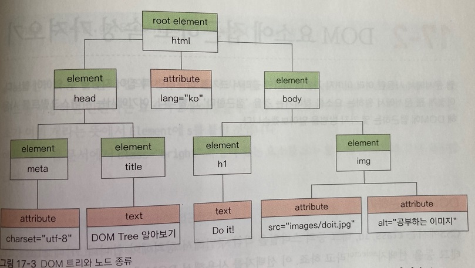

## 문서 객체 모델 알아보기

 

자바스크립트를 공부하다 보면 'DOM'이란 말을 자주 만날 것이다.

DOM은 문서 객체 모델(document object model)의 줄임말이다.

문서 객체 모델을 자바스크립트 프로그래밍에서 매우 중요한 개념이니 꼼꼼히 살펴보고 잘 이해하고 넘어가야 한다.

***
### 문서 객체 모델이란

 

웹에서 자바스크립트 사용하는 이유는 어떤 조건에 맞거나 사용자의 동작이 있을 때 웹 문서 전체 또는 일부분이 동적으로 반응하게 하는 것이다.

이렇게 반응하게 하려면 웹 문서의 모든 요소를 따로 제어할 수 있어야 한다.

예를 들어 웹 문서에 텍스트와 이미지가 들어 있다면 웹 브라우저는 마크업 정보를 보면서 텍스트 단락이 몇 개이고 그 내용이 무엇인지 살펴본다.

또한 이미지가 몇개이고 이미지 파일 경로는 어떠한지 대체 텍스트는 무엇인지도 파악해서 이미지별로 정리해서 인식한다.
그리고 이러한 텍스트와 이미지 요소를 브라우저가 제어하려면 두 요소를 따로 구별하여 인식해야 한다.

이보다 더 많은 요소를 사용한 웹 문서라면 요소 사이의 포함 관계도 알아야 한다.

 

이러한 모든 정보 요소를 자바스크립트로 가져와 프로그래밍할 때 사용한다.

이때 알아야할 개념이 있는데 바로 문서 객체 모델(DOM)이다.

다음은 문서 객체 모델을 정의한 것이다.

    문서 객체 모델(DOM)의 정의

    자바스크립트를 이용하여 웹 문서에 접근하고 제어할 수 있도록 객체를 사용해 웹 문서를 체계적으로 정리하는 방법

HTML 언어로 작성한 웹 문서의 DOM을 HTML, DOM이라고 하며, XML 문서에서 사용하는 XML DOM도 있다.

DOM은 웹 문서를 하나의 객체로 정의한다.

그리고 웹 문서를 이루는 텍스트나 이미지, 표 등의 모든 요소도 각각 객체로 정의한다.

예를 들어 웹 문서 전체는 document객체이고, 삽입한 이미지는 image객체이다.

이처럼 DOM은 웹 문서와 그 안의 모든 요소를 '객체'로 인식하고 처리한다.

앞에서 배웠던 브라우저 객체와 마찬가지로 웹 문서 객체도 다양한 프로퍼티와 메서드가 있다.

우선 문서 객체 모델의 구조를 나타내는 DOM 트리를 알아보자

***
### DOM 트리

 

자바스크립트로 DOM을 조작하려면 실체 웹 문서가 DOM으로 어떻게 표현되는지 알아야한다.

DOM은 웹 문서의 요소를 부몽 요소와 자식 요소로 구분한다.

예를 들어 다음과 같은 간단한 소스를 생각해 보자.

[HTML의 요소 관계 알아보기](./Doit_JavaScript_day37-1.html)

 

그리고 CSS에서 다루었던 요소의 부모 자식 관계를 떠올려 보자

이 예제에서 html 요소는 head, body의 부모 요소이고, 다시 body요소는 h1, img의 부모 요소가 된다.

한 단계 더 발전하여 DOM의 관점에서 부모 자식 관계를 생각해 보자.

DOM은 문서 안의 요소뿐만 아니라 각 요소에서 사용한 내용ㅇ과 속성도 자식으로 나타낸다.

다음 그림을 보면 h1 요소의 내용인 'Do it!'은 h1의 자식이 되고 src, alt 속성은 img 요소의 자식이 되는 것이다.

이렇게 부모와 자식 구조로 표시하면 마치 나무 형태가 되므로 DOM 트리라고 한다.

DOM 트리에서 가지가 갈라져 나간 항목을 노드(node)라고 하며, DOM 트리의 시작 부분인 html 노드를 나무 뿌리에 해당한다 해서 루트(root) 노드라고 한다.

루트 노드를 시작으로 웹 문서에서 사용한 요소는 계층 구조를 이룬다.

따라서 각 노드 사이의 관계를 부모와 자식, 형제 간으로 표현할 수 이싿.

부모(parents)노드에는 자식(child)노드가 있으며, 부모 노드가 같은 형제(sibling)노드도 있다.

HTML 소스를 코딩할 때에는 들여쓰기를 잘해야 한다.

그래야 소스만 봐도 HTML DOM의 계층 구조를 머릿속으로 그릴수 있다.

 

DOM을 구성하는 기본 원칙은 다음과 같다.

1) 모든 HTML 태그는 요소(element)노드이다.

2) HTML 태그에서 사용하는 텍스트 내용은 자식 노드인 텍스트(text) 노드이다.

3) HTML 태그에 있는 속성은 자식 노드인 속성(attribute) 노드이다.

4) 주석은 주석(comment) 노드이다.

위의 DOM 트리를 노드의 종류대로 구분해서 다시 그리면 다음과 같다.

이렇게 웹 문서를 해석할 DOM 구조를 만드는 것이 중요하다.

DOM 트리를 머릿속으로 그릴 수 있어야 자바스크립트를 사용해서 객체에 접근해서 원하는 부분을 수정할 수 있기 때문이다.