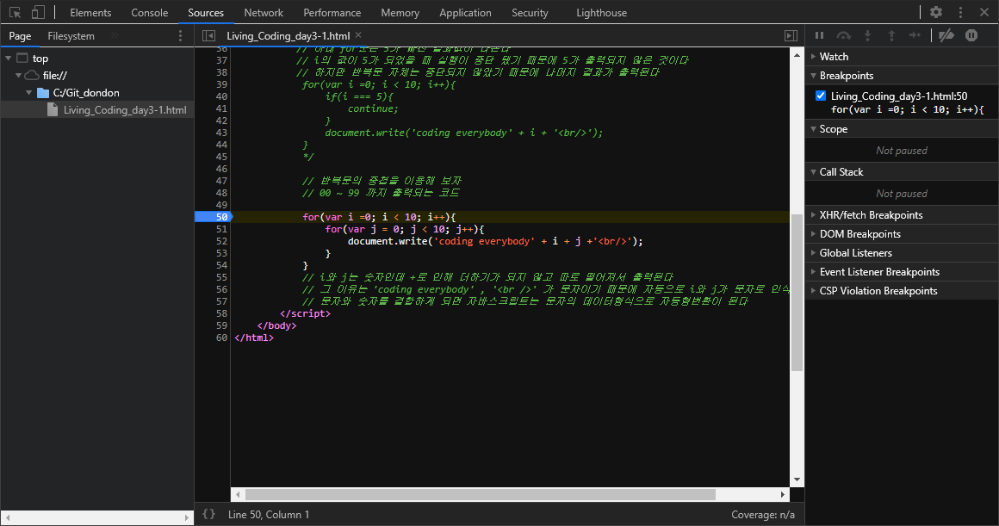
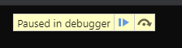
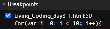
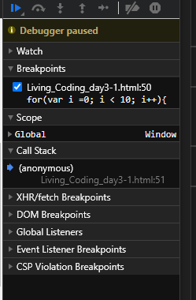
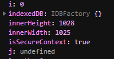
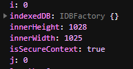
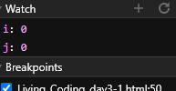

## 반복문

***
### while
***
while문은 크게 3가지로 구성

1)반복문이 언제까지 반복할 것인가에 대한 기준점을 제공을 하는 i라는 변수를 초기화

2)반복 횟수를 지정하는 반복조건

3)반복적으로 실행될때 마다 i라는 변수를 갱신하는 구문

var i = 0;  
while (조건){  
    반복해서 실행할 코드  
}  

***
### for
***

- ## while 문에서 쓰이는 빈도가 높은 구문들을 간략화 시켜 쓸 수 있는 반복문

1) 첫구절에 반복작업을 할때 반드시 필요한 3가지 요소가 한줄에 들어가있다

2) 1의 이유로 가독성이 좋다

3) 단점이라면 첫구절의 순서를 기억해야한다는것

###    for(초기화, 반복조건/true or false, 반복적으로 실행시켜야할 블럭안의 구문들이 실행된후 실행)

          1              2                                 3

                         4                                 5

                         6                                 7

                                      ...
                                와 같이 반복 실행

4) 어느곳에나 for문이 무조건 좋은것은 아니다

for(var i =0; i < 10; i = i + 1){  
    document.write("coding everybody" + i + "\ ")  
}
 

***
## i = i + 1; 의 간략화
***

i = i + 1; 는  i++; , ++i; 와 '대충' 같다

1씩 증가한다는 점에서 같은데 둘의 다른점은 

i가 0인 상태에서 

- i++를 하게되면 0이 출력된다 / 기존의 값이 출력된후 1 증가

- ++i를 하게되면 1이 출력된다 / 기존의 값을 1 증가 시킨후 출력

***
## 반복문의 제어
***

반복작업을 중간에 중단시키고 싶다면 break를 사용하면 된다

그럼 실행을 즉시 중단 하면서 반복은 지속돼게 하려면 어떻게 해야 할까? continue를 사용하면 된다 

***
## 반복문의 중첩
***

// 0부터 9까지 변수 i에 순차적으로 값을 할당          
for(var i = 0; i < 10; i++){  
    // 0부터 9까지의 변수를 j의 값에 순차적으로 할당  
    for(var j = 0; j < 10; j++){     
        // i와 j의 값을 더한 후에 출력  
        // String은 숫자인 i와 j의 데이터 타입을 문자로 형태를 변환하는 명령이다.  
        // String()을 제거하고 실행해보면 의미가 좀 더 분명하게 드러날 것이다.  
        document.write(String(i)+String(j)+' ');  
    }  
}  

***
### 브라우저 디버거를 이용해 중첩된 for문의 작동 원리를 알아보자

크롬브라우저에서 F12로 콘솔창을 연후에 

sources 탭으로 이동

F5로 재실행하면 위와 같이 뜬다

for문이 시작되는 50번 줄을 클릭하면 breakpoints가 잡힌다

하나하나씩 동작이 되도록 조작할 수 있다

하나하나씩 실행되는 모습

제어창 전체모습

여기서 Scope에 Global을 열어서

i와 j를 찾아 볼 수 있다

j는 아직 정의되지 않았지만

짠!

Watch에서 i와 j를 검색해 그 값만 볼 수 도 있다
