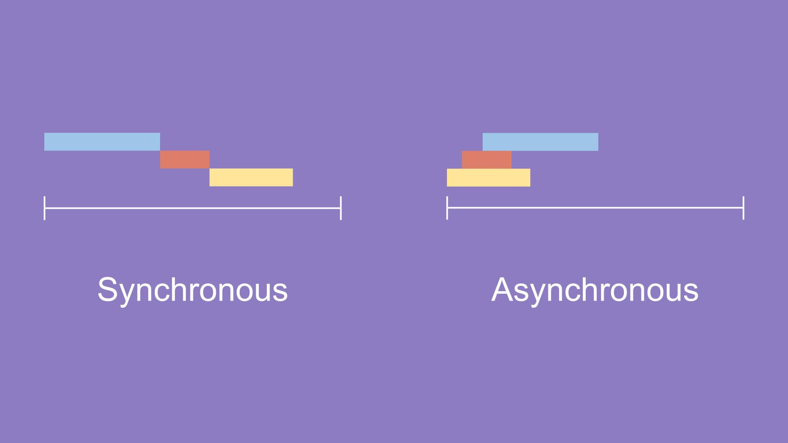

***
## 값으로서 함수와 콜백
***
***
### 함수의 용도 1
***
JavaScript에서는 함수도 객체다. 다시 말해서 일종의 값이다. 

거의 모든 언어가 함수를 가지고 있다.

 JavaScript의 함수가 다른 언어의 함수와 다른 점은 함수가 값이 될 수 있다는 점이다. 
 
 다음 예제를 통해서 그 의미를 알아보자.

    function a(){}

이건 이것과 같다

    var a = function(){}

위의 예제에서 함수 a는 변수 a에 담겨진 값이다. 

또한 <b>함수는 객체의 값으로 포함될 수 있다. </b>

이렇게 <b>객체의 속성 값으로 담겨진 함수를 메소드(method)</b>라고 부른다.

    a = {
        b:function(){
        }
    };
위의 예제에서 b는 변수의 역할도 하고 있다.

b에 function(){}이라는 값을 저장 하고 있기 때문이다.

이렇게 객체 안에서 변수의 역할을 하는것을 다른 말로는 <b>속성, property</b> 이라고 한다.

이러한 맥락에서 속성에 저장된 값이 함수라면 그 함수를 메소드라고 부르는 것이다.

### a라는 변수에 담긴 객체 안에는 b라는 속성이 있는데 그 속성에 담긴 값이 함수라면 그 함수를 메소드라고 부른다.

함수는 값이기 때문에 다른 함수의 인자로 전달 될수도 있다. 아래 예제를 보자.

    function cal(func, num){
        return func(num)
    }
    function increase(num){
        return num+1
    }
    function decrease(num){
        return num-1
    }
    alert(cal(increase, 1));
    alert(cal(decrease, 1));

10행을 실행하면 함수 increase와 값 1이 함수 cal의 인자로 전달된다. 

함수 cal은 첫번째 인자로 전달된 increase를 실행하는데 이 때 두번째 인자의 값이 1을 인자로 전달한다. 

함수 increase은 계산된 결과를 리턴하고 cal은 다시 그 값을 리턴한다.

***
### 함수의 용도 2
***

함수는 함수의 리턴 값으로도 사용할 수 있다.

    function cal(mode){
        var funcs = {
            'plus' : function(left, right){return left + right},
            'minus' : function(left, right){return left - right}
        }
        return funcs[mode];
    }
    alert(cal('plus')(2,1));
    alert(cal('minus')(2,1));   

당연히 배열의 값으로도 사용할 수 있다.

    var process = [
        function(input){ return input + 10;},
        function(input){ return input * input;},
        function(input){ return input / 2;}
    ];
    var input = 1;
    for(var i = 0; i < process.length; i++){
        input = process[i](input);
    }
    alert(input);

***
***
## 콜백
***
***
### 처리의 위임
***

값으로 사용될 수 있는 특성을 이용하면 함수의 인자로 함수로 전달할 수 있다. 

값으로 전달된 함수는 호출될 수 있기 때문에 이를 이용하면 함수의 동작을 완전히 바꿀 수 있다. 

인자로 전달된 함수 sortNumber의 구현에 따라서 sort의 동작방법이 완전히 바뀌게 된다.

    function sortNumber(a,b){
        // 위의 예제와 비교해서 a와 b의 순서를 바꾸면 정렬순서가 반대가 된다.
        return b-a;
    }
    var numbers = [20, 10, 9,8,7,6,5,4,3,2,1];
    alert(numbers.sort(sortNumber)); // array, [20,10,9,8,7,6,5,4,3,2,1]

*** 

### 동기 vs 비동기

동기와 비동기를 나누는 가장 큰 차이점을 어떻게 실행 순서를 가지는 지에 있다.

위에 첨부한 이미지와 같이 Syncronous 동기는 요청을 보낸 후 해당 요청의 응답을 받아야 다음 동작을 실행하는 방식을,
Asynchronous 비동기는 요청을 보낸 후 응답과 관계없이 다음 동작을 실행할 수 있는 방식을 의미한다.
***

#### 동기적 방식

은행 업무를 보러 가면 번호표를 뽑고 기다린 후 차례가 되었을 때 

한 명의 행원이 나의 업무가 다 끝날 때까지 처리를 맡아주어 해당 행원은 다른 업무를 보지 못하게 된다. 

나의 업무가 모두 끝나야 다음 차례의 업무를 볼 수 있다.

이렇게 발생하는 하나의 이벤트가 모두 끝날 때까지 다른 이벤트를 처리하지 못하고 

이벤트가 모두 완료 된 후 다음 이벤트를 동작하는 실행 순서가 확실한 것을 동기적 방식이라 부른다.

 

### 비동기적 방식

카페에서 주문을 하게되면 지속적으로 주문을 받고 제조되는 순서대로 커피를 받게 된다. 

은행 업무와 달리 먼저 주문한 사람의 커피가 다 제조될 때까지 다음 사람이 기다릴 필요가 없기 때문에 

카페에 '들어온 순서' 보다 커피가 '먼저 제조된 순서'가 중요하게 된다.

이처럼 연속적으로 발생하는 이벤트를 담은 후 완료되는 순서대로 

일을 처리하는 실행 순서가 확실하지 않는 것을 비동기적 방식이라 한다.

***
### 비동기 처리

콜백은 비동기처리에서도 유용하게 사용된다. 

시간이 오래걸리는 작업이 있을 때 이 작업이 완료된 후에 처리해야 할 일을 콜백으로 지정하면 

해당 작업이 끝났을 때 미리 등록한 작업을 실행하도록 할 수 있다. 

다음 코드는 일반적인 환경에서는 작동하지 않고 서버 환경에서만 동작한다. 

동영상을 참고한다.

    datasource.json.js

    {"title":"JavaScript","author":"egoing"}
    demo1.html

    <!DOCTYPE html>
    <html>
    <head>
    
    </head>
    <body>
    
    </body>
    </html>
 
 ***