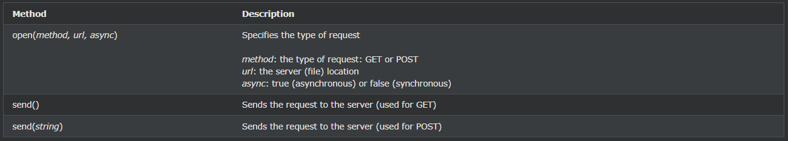
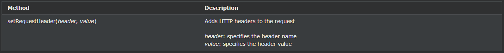

## AJAX - XMLHttpRequest

XMLHttpRequest 객체는 서버에서 데이터를 요청하는 데 사용됩니다.

---

### 서버에 요청 보내기

서버에 요청을 보내려면 XMLHttpRequest객체 의 open() 및 send() 메서드를 사용 합니다.

    xhttp.open("GET", "ajax_info.txt", true);
    xhttp.send();

---

### URL - 서버의 파일

open()메소드 의 url 매개변수 는 서버에 있는 파일의 주소입니다.

    xhttp.open("GET", "ajax_test.asp", true);

파일은 .txt 및 .xml과 같은 모든 종류의 파일이거나 .asp 및 .php와 같은 서버 스크립팅 파일(응답을 다시 보내기 전에 서버에서 작업을 수행할 수 있음)일 수 있습니다.

---

### 비동기 - 참 또는 거짓?

서버 요청은 비동기적으로 보내야 합니다.

open() 메서드의 async 매개변수는 true로 설정해야 합니다.

    xhttp.open("GET", "ajax_test.asp", true);

비동기식으로 전송하면 JavaScript는 서버 응답을 기다릴 필요가 없지만 대신 다음을 수행할 수 있습니다.

- 서버 응답을 기다리는 동안 다른 스크립트 실행
- 응답이 준비된 후 응답 처리

async 매개변수의 기본값은 async = true입니다.

코드에서 세 번째 매개변수를 안전하게 제거할 수 있습니다.

    동기식 XMLHttpRequest(async = false)는 서버 응답이 준비될 때까지 JavaScript 실행이 중지되므로 권장되지 않습니다. 서버가 사용 중이거나 느린 경우 응용 프로그램이 중단되거나 중지됩니다.

---

### GET 또는 POST?

GET보다 간단하고 빠르며 POST대부분의 경우에 사용할 수 있습니다.

그러나 다음과 같은 경우 항상 POST 요청을 사용하십시오.

- 캐시된 파일은 옵션이 아닙니다(서버의 파일 또는 데이터베이스 업데이트).
- 많은 양의 데이터를 서버로 전송합니다(POST에는 크기 제한이 없습니다).
- 사용자 입력(알 수 없는 문자를 포함할 수 있음)을 보내는 POST는 GET보다 강력하고 안전합니다.

---

### GET 요청

간단한 GET요청:

    예시
    xhttp.open("GET", "demo_get.asp");
    xhttp.send();

위의 예에서 캐시된 결과를 얻을 수 있습니다. 이를 방지하려면 URL에 고유 ID를 추가하십시오.

    예시
    xhttp.open("GET", "demo_get.asp?t=" + Math.random());
    xhttp.send();

GET메소드 로 정보를 보내려면 URL에 정보를 추가하십시오.

    예시
    xhttp.open("GET", "demo_get2.asp?fname=Henry&lname=Ford");
    xhttp.send();

서버가 입력을 사용하는 방법과 서버가 요청에 응답하는 방법은 이후 장에서 설명합니다.

---

### POST 요청

간단한 POST요청:

    예시
    xhttp.open("POST", "demo_post.asp");
    xhttp.send();

HTML 양식과 같은 데이터를 POST하려면 setRequestHeader(). send()메서드 에서 보낼 데이터를 지정합니다 .

    예시
    xhttp.open("POST", "ajax_test.asp");
    xhttp.setRequestHeader("Content-type", "application/x-www-form-urlencoded");
    xhttp.send("fname=Henry&lname=Ford");

---

### 동기 요청

동기 요청을 실행하려면 open()메서드 의 세 번째 매개변수를 다음으로 변경합니다 false.

    xhttp.open("GET", "ajax_info.txt", false);

빠른 테스트를 위해 async = false가 사용되는 경우가 있습니다. 또한 이전 JavaScript 코드에서 동기 요청을 찾을 수 있습니다.

코드는 서버 완료를 기다리므로 onreadystatechange 함수 가 필요하지 않습니다 .

    예시
    xhttp.open("GET", "ajax_info.txt", false);
    xhttp.send();
    document.getElementById("demo").innerHTML = xhttp.responseText;

동기식 XMLHttpRequest(async = false)는 서버 응답이 준비될 때까지 JavaScript 실행이 중지되므로 권장되지 않습니다. 서버가 사용 중이거나 느린 경우 응용 프로그램이 중단되거나 중지됩니다.

최신 개발자 도구는 동기 요청 사용에 대해 경고하도록 권장되며 발생 시 InvalidAccessError 예외가 발생할 수 있습니다.
