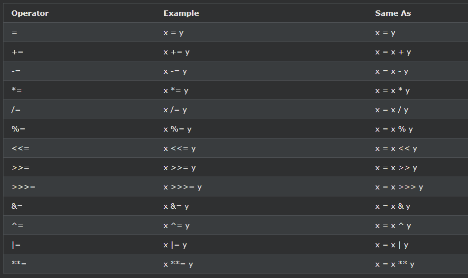

## JavaScript Assignment

---

### JavaScript 할당 연산자

할당 연산자는 JavaScript 변수에 값을 할당합니다.

---

### 할당 예

=할당 연산자는 변수에 값을 할당한다.

    과제
    let x = 10;

+=할당 연산자는 변수에 값을 추가한다.

    과제
    let x = 10;
    x += 5;

-=할당 연산자는 변수의 값을 감산한다.

    과제
    let x = 10;
    x -= 5;

\*=할당 연산자의 곱 변수.

    과제
    let x = 10;
    x \*= 5;

/=할당 변수를 나눕니다.

    과제
    let x = 10;
    x /= 5;

%=할당 연산자는 변수에 나머지를 할당합니다.

    과제
    let x = 10;
    x %= 5;
