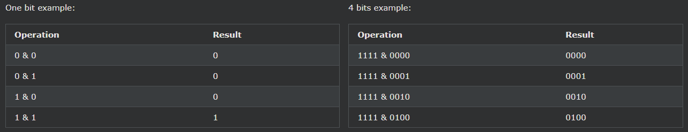
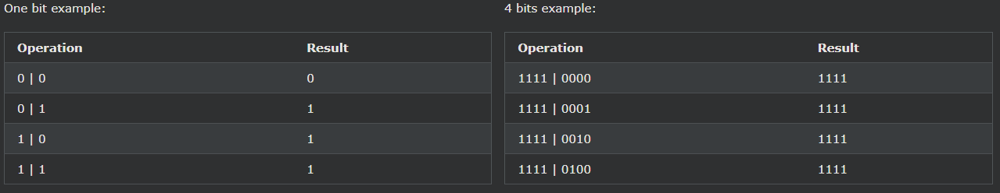
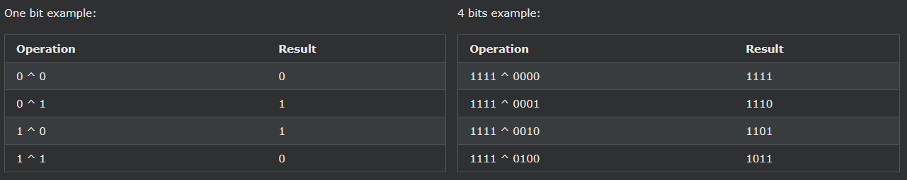

## JavaScript Bitwise Operations

---

### JavaScript 비트 연산자

| Operator | Name                                                                                                                        | Description |
| -------- | --------------------------------------------------------------------------------------------------------------------------- | ----------- |
| &        | AND Sets each bit to 1 if both bits are 1                                                                                   |
| \|       | OR Sets each bit to 1 if one of two bits is 1                                                                               |
| ^        | XOR Sets each bit to 1 if only one of two bits is 1                                                                         |
| ~        | NOT Inverts all the bits                                                                                                    |
| <<       | Zero fill left shift Shifts left by pushing zeros in from the right and let the leftmost bits fall off                      |
| >>       | Signed right shift Shifts right by pushing copies of the leftmost bit in from the left, and let the rightmost bits fall off |
| >>>      | Zero fill right shift Shifts right by pushing zeros in from the left, and let the rightmost bits fall off                   |

---

### JavaScript는 32비트 비트 피연산자를 사용합니다.

JavaScript는 숫자를 64비트 부동 소수점 숫자로 저장하지만 모든 비트 연산은 32비트 이진수에서 수행됩니다.

비트 연산이 수행되기 전에 JavaScript는 숫자를 32비트 부호 있는 정수로 변환합니다.

비트 연산이 수행된 후 결과는 다시 64비트 JavaScript 숫자로 변환됩니다.

    위의 예에서는 4비트의 부호 없는 이진수를 사용합니다. 이 때문에 ~ 5는 10을 반환합니다.

    JavaScript는 32비트 부호 있는 정수를 사용하므로 10을 반환하지 않고 -6을 반환합니다.

    0000000000000000000000000000101 (5)

    111111111111111111111111111111010 (~5 = -6)

    부호 있는 정수는 가장 왼쪽 비트를 빼기 기호로 사용합니다.

---

### Bitwise AND

비트 쌍에 대해 비트 AND를 수행하면 두 비트가 모두 1이면 1을 반환합니다.

---

### Bitwise OR

비트 쌍에 대해 비트 OR이 수행되면 비트 중 하나가 1이면 1을 반환합니다.

---

### Bitwise XOR

비트 쌍에 대해 비트 XOR을 수행할 때 비트가 다르면 1을 반환합니다.

---

### JavaScript 비트 AND(&)

비트 AND는 두 비트가 모두 1인 경우에만 1을 반환합니다.

| Decimal | Binary                              |
| ------- | ----------------------------------- |
| 5       | 0000000000000000000000000000101     |
| 1       | 0000000000000000000000000000001     |
| 5 & ​​1 | 0000000000000000000000000000001 (1) |

    예시
    let x = 5 & 1;

---

### JavaScript 비트 OR(|)

비트 OR은 비트 중 하나가 1인 경우 1을 반환합니다.

| Decimal | Binary                              |
| ------- | ----------------------------------- |
| 5       | 0000000000000000000000000000101     |
| 1       | 0000000000000000000000000000001     |
| 5 \| 1  | 0000000000000000000000000000101 (5) |

    예시
    let x = 5 | 1;

---

### JavaScript 비트 XOR(^)

비트별 XOR은 비트가 다른 경우 1을 반환합니다.

| Decimal | Binary                              |
| ------- | ----------------------------------- |
| 5       | 0000000000000000000000000000101     |
| 1       | 0000000000000000000000000000001     |
| 5 ^ 1   | 0000000000000000000000000000100 (4) |

    예시
    let x = 5 ^ 1;

---

### JavaScript 비트 NOT(~)

| Decimal | Binary                                |
| ------- | ------------------------------------- |
| 5       | 0000000000000000000000000000101       |
| ~5      | 11111111111111111111111111111010 (-6) |

    예시
    let x = ~5;

---

### JavaScript(0 채우기) 비트 왼쪽 시프트(<<)

이것은 0 채우기 왼쪽 시프트입니다. 하나 이상의 0비트가 오른쪽에서 입력되고 맨 왼쪽 비트가 떨어집니다.

| Decimal | Binary                               |
| ------- | ------------------------------------ |
| 5       | 0000000000000000000000000000101      |
| 5 << 1  | 0000000000000000000000000001010 (10) |

    예시
    let x = 5 << 1;

---

### JavaScript(부호 보존) 비트 오른쪽 시프트(>>)

이것은 오른쪽 시프트를 유지하는 기호입니다. 맨 왼쪽 비트의 복사본이 왼쪽에서 밀려 들어가고 맨 오른쪽 비트가 떨어집니다.

| Decimal | Binary                                 |
| ------- | -------------------------------------- |
| -5      | 111111111111111111111111111111011      |
| -5 >> 1 | 111111111111111111111111111111101 (-3) |

    예시
    let x = -5 >> 1;

---

### JavaScript(제로 채우기) 오른쪽 시프트(>>>)

이것은 0 채우기 오른쪽 시프트입니다. 왼쪽에서 하나 이상의 0비트가 입력되고 가장 오른쪽 비트가 떨어집니다.

| Decimal | Binary                              |
| ------- | ----------------------------------- |
| 5       | 0000000000000000000000000000101     |
| 5 >>> 1 | 0000000000000000000000000000010 (2) |

    예시
    let x = 5 >>> 1;

---

### 이진수

1비트 세트만 있는 이진수는 이해하기 쉽습니다.

| 이진 표현                        | 10진수 값 |
| -------------------------------- | --------- |
| 0000000000000000000000000000001  | 1         |
| 00000000000000000000000000000010 | 2         |
| 00000000000000000000000000000100 | 4         |
| 00000000000000000000000000001000 | 8         |
| 00000000000000000000000000010000 | 16        |
| 00000000000000000000000000100000 | 32        |
| 00000000000000000000000001000000 | 64        |

몇 비트를 더 설정하면 이진 패턴이 나타납니다.

| 이진 표현                        | 10진수 값           |
| -------------------------------- | ------------------- |
| 0000000000000000000000000000101  | 5 (4 + 1)           |
| 00000000000000000000000000001101 | 13 (8 + 4 + 1)      |
| 00000000000000000000000000101101 | 45 (32 + 8 + 4 + 1) |

JavaScript 이진수는 2의 보수 형식으로 저장됩니다.

즉, 음수는 숫자에 1을 더한 비트 NOT입니다.

| 이진 표현                         | 10진수 값 |
| --------------------------------- | --------- |
| 0000000000000000000000000000101   | 5         |
| 111111111111111111111111111111011 | -5        |
| 00000000000000000000000000000110  | 6         |
| 111111111111111111111111111111010 | -6        |
| 00000000000000000000000000101000  | 40        |
| 111111111111111111111111111011000 | -40       |

---

### 10진수를 2진수로 변환

    예시
    function dec2bin(dec){
      return (dec >>> 0).toString(2);
    }

---

### 2진수를 10진수로 변환

    예시
    function bin2dec(bin){
      return parseInt(bin, 2).toString(10);
    }
